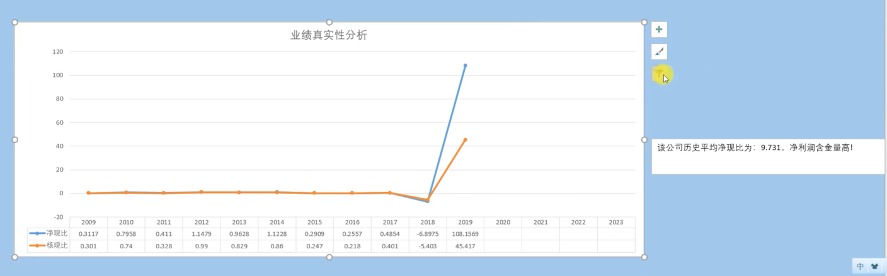

# buffett 财报分析

让天下没有难读的财报

### 主要财务指标解释

#### 1 业绩和成长分析

平均增长率 复合增长速率

* 净利润（利润总额-所得税）

在利润总额中按规定缴纳了所得税以后公司的利润留存，一般也称为税后利润或净收入。净利润是一家企业经营的最终成果：净利润多，企业的经营效益就好；净利润少，企业的经营效益就差。它是衡量一家企业经营效益的主要指标。

* 扣非净利润(净利润-非经常损益)

扣非净利润全称是扣除非经常损益后的净利润。非经常性损益的特点就在于名字里的“非”字，意思就是不经常发生的，不能持续获取的损益，比如：出售子公司股权、处置在建工程、无形资产和其他长期资产的损益；各种形式的政府补贴；各种减值准备的转回；以及证监会认定的符合定义要求的其他非经常性损益项目。
扣非净利润是公司可持续的净利润。

* 营业收入

企业卖出产品或者提供劳务所获得的收益，反映了企业的销售能力和市场竞争力。

* 营收增长率 利润增长率 净利润增长率

#### 2 盈利能力分析

盈利能力

* 营业毛利率
* 营业利润率
* 营业净利率
* 核心利润率

核心利润及其贡献率

* 核心利润贡献率 = 核心利润/营业收入
* 核心利润 = 营业收入-营业成本- 税金及附加- 销售费用- 管理费用- 财务费用

#### 3 业绩含金量分析

净利润与营收现金净流量

* 经营活动现金净流量
* 净利润
* 扣非净利润

业绩真实性分析

* 净现比:也称为净利润现金含量，等于经营活动现金净流量/净利润，净现比指标越高，表明企业的销售回款能力越强且用于生产经营投入的成本费用占比越低，即企业的财务压力越小。
* 核现比:   核心利润/净利润
* 收现比:  销售商品、提供劳务收到的现金/营业收入
  

销商与营收

* 销售商品劳务收到的现金
* 营业收入
  

#### 4 资产结构分析

主要资产结构

* 商誉
* 长期股权投资
* 在建工程
* 固定资产
* 存货
* 应收账款
* 货币资金
  

经营性资产及其占比

* 经营性资产:经营资产指的是销售商品或者提供劳务所涉及的资产，经营资产科目包括原材料、应收账款、预付账款、库存商品、固定资产、无形资产、长期股权投资、银行存款以及库存现金、其他流动资产
* 经营性资产占比: 经营性资产/总资产

固定资产率

* 固定资产率
* 营收增长率

固定资产占比下降但是营收增长，好的商业模式

预付款及其占营收的比率

* 预付款
* 预付款占营收比率

#### 5 现金流分析

公司现金流画像（蛮牛，穷奶牛，奶牛，母鸡，老母鸡）

公司现金流结构

* 经营活动现金净流量
* 筹资
* 投资

自由现金流

资金流入构成分析

* 经营活动现金流入占比
* 投资
* 筹资

资金流出构成分析

* 经营活动现金流出占比
* 投资
* 筹资

现金购销比 购买商品、接受劳务支付的现金 / 销售商品、提供劳务收到的现金 越低越好

#### 6 资产盈利能力分析

资产盈利能力

* ROIC(资本回报率)
* ROA(总资产收益率)
* ROE(净资产收益率)

净资产和roe

* 净资产 bar
* roe lin
* 统计历年平均roe

资本盈利能力

* 资本收益率
净利润/所有者权益 反映企业运用资本获得收益的能力

#### 7 偿债能力分析

短期偿债能力分析

* 流动比率
* 现金比率

长期偿债能力分析

* 长期资本负债率 line

资产负债率和有息负债率

* 资产负载率
* 有息负债率
有息负债 = 一年内到期的非流动负债 + 长短期借款 + 应付债券 + 交易性金融负债
  

货币资金和有息负债

* 有息负债
* 货币资金
  

#### 管理层营运能力分析
运营能力分析
* 流动资产周转率
* 固定资产周转率
* 总资产周转率

占款能力
(应付类 + 预收 + 合同负债 - 应收类 - 预付) / 总营收

https://xueqiu.com/6615553088/134113458

预收款/因收款

存货周转率

循环周期
存货周转天数
应收转款周转天数 = 365 / (营业收入/((期初应收账款 + 期末应收账款) / 2))
应付账款周转天数 = 365 / (营业成本/((期初应付账款 + 期末应付账款) / 2))
现金循环周期 = 存货周转天数 + 应收转款周转天数 - 应付账款周转天数

费用占营收的比率

* 财务费用占比
* 研发
* 管理
* 销售

费用增长率和营收增长率

* 营收增长
* 费用增长

存货增长率和营收增长率

* 存货增长率
* 营收增长率
  

杜邦分析

* 权益乘数
* 总资产周率
* 营业净利润
* ROE

CGO_ENABLED=0 GOOS=linux GOARCH=amd64 go build main.go